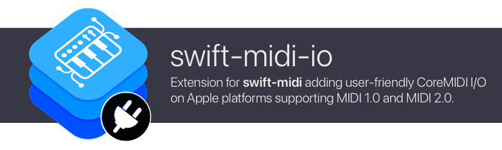

# swift-midi-io

[](https://swiftpackageindex.com/orchetect/swift-midi-io) [](https://swiftpackageindex.com/orchetect/swift-midi-io) [](https://github.com/orchetect/swift-midi-io/blob/main/LICENSE)

Extension for [swift-midi](https://github.com/orchetect/swift-midi) adding user-friendly CoreMIDI I/O on Apple platforms supporting MIDI 1.0 and MIDI 2.0.

## Compatibility

| macOS | iOS  | visionOS | Linux | Android | Windows |
| :---: | :--: | :------: | :---: | :-----: | :-----: |
|   🟢   |  🟢   |    🟢     |   -   |    -    |    -    |

tvOS and watchOS do not have CoreMIDI I/O implemented in the operating system.

## Getting Started

This extension is available as a Swift Package Manager (SPM) package.

To use this extension as standalone dependency (instead of importing the **swift-midi** umbrella repository):

1. Add the **swift-midi-io** repo as a dependency.

   ```swift
   .package(url: "https://github.com/orchetect/swift-midi-io", from: "1.0.0")
   ```

2. Add **SwiftMIDIIO** to your target.

   ```swift
   .product(name: "SwiftMIDIIO", package: "swift-midi-io")
   ```

3. Import **SwiftMIDIIO** to use it.

   ```swift
   import SwiftMIDIIO
   ```

## Documentation & Support

See the [online documentation](https://swiftpackageindex.com/orchetect/swift-midi-io/main/documentation) for this repository and the dedicated [code examples](https://github.com/orchetect/swift-midi-examples) repository.

For support, feature requests, and bug reports see the main [swift-midi](https://github.com/orchetect/swift-midi) repository.

## Author

Coded by a bunch of 🐹 hamsters in a trenchcoat that calls itself [@orchetect](https://github.com/orchetect).

## License

Licensed under the MIT license. See [LICENSE](https://github.com/orchetect/swift-midi-io/blob/master/LICENSE) for details.